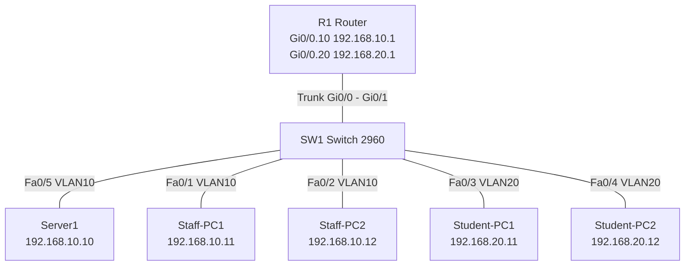

# Lab 6: Build a Small Network in Packet Tracer

> Build this in Cisco Packet Tracer, save the file as `network.pkt` in this folder, and add a screenshot of the topology to `screenshots/`.

## Topology



## Configuration Table

| Device | Interface | IP address | Subnet mask | Gateway | VLAN |
| --- | --- | --- | --- | --- | --- |
| R1 | Gi0/0.10 | 192.168.10.1 | 255.255.255.0 | - | 10 (Staff) |
| R1 | Gi0/0.20 | 192.168.20.1 | 255.255.255.0 | - | 20 (Students) |
| Server1 | NIC | 192.168.10.10 | 255.255.255.0 | 192.168.10.1 | 10 |
| Staff-PC1 | NIC | 192.168.10.11 | 255.255.255.0 | 192.168.10.1 | 10 |
| Staff-PC2 | NIC | 192.168.10.12 | 255.255.255.0 | 192.168.10.1 | 10 |
| Student-PC1 | NIC | 192.168.20.11 | 255.255.255.0 | 192.168.20.1 | 20 |
| Student-PC2 | NIC | 192.168.20.12 | 255.255.255.0 | 192.168.20.1 | 20 |

## Steps
1. Place: 1 router (2911), 1 switch (2960), 4 PCs, 1 server. Connect with copper straight-through cables as in the diagram (router Gi0/0 to switch Gi0/1).
2. Set each PC/server IP, mask, and gateway from the table (Desktop > IP Configuration).
3. Paste the configs below.

**Switch SW1**
```
enable
configure terminal
vlan 10
 name STAFF
vlan 20
 name STUDENTS
interface range fa0/1 - 2
 switchport mode access
 switchport access vlan 10
interface fa0/5
 switchport mode access
 switchport access vlan 10
interface range fa0/3 - 4
 switchport mode access
 switchport access vlan 20
interface gi0/1
 switchport mode trunk
end
write memory
```

**Router R1**
```
enable
configure terminal
interface gigabitEthernet0/0
 no shutdown
interface gigabitEthernet0/0.10
 encapsulation dot1Q 10
 ip address 192.168.10.1 255.255.255.0
interface gigabitEthernet0/0.20
 encapsulation dot1Q 20
 ip address 192.168.20.1 255.255.255.0
! Segmentation: block students from reaching staff network
ip access-list extended STUDENT-IN
 deny ip 192.168.20.0 0.0.0.255 192.168.10.0 0.0.0.255
 permit ip any any
interface gigabitEthernet0/0.20
 ip access-group STUDENT-IN in
end
write memory
```

## Connectivity Tests (record your results)

| Test | Expected | Your result |
| --- | --- | --- |
| Staff-PC1 to Staff-PC2 | Success | |
| Staff-PC1 to Server1 | Success | |
| Student-PC1 to Student-PC2 | Success | |
| Student-PC1 to gateway 192.168.20.1 | Success | |
| Student-PC1 to Staff-PC1 | **Fails** (blocked by ACL) | |
| Staff-PC1 to Student-PC1 | Fails too, because the return traffic is blocked by the stateless ACL | |

*Before applying the ACL, all pings should succeed. Test first, then add the ACL.*

## Segmentation Idea
Staff and students are placed in separate VLANs/subnets. Routing between them passes through R1, where an ACL blocks the student network from reaching staff systems and the server. Students still get their own network and internet access. A further idea: put the server in its own VLAN (e.g., VLAN 30) and allow students only the specific services they need.

## Student Questions

**What device connects different IP networks?**  
A router. (A switch only connects devices inside the same network/VLAN.)

**Why is segmentation useful?**  
It limits how far an attacker or malware can spread, lets you apply different security rules to different groups, reduces broadcast traffic, and protects sensitive systems from less trusted users.
